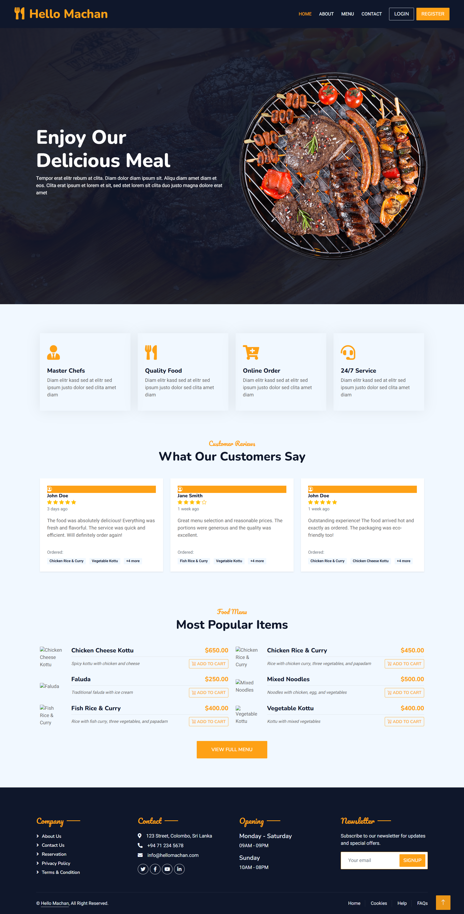
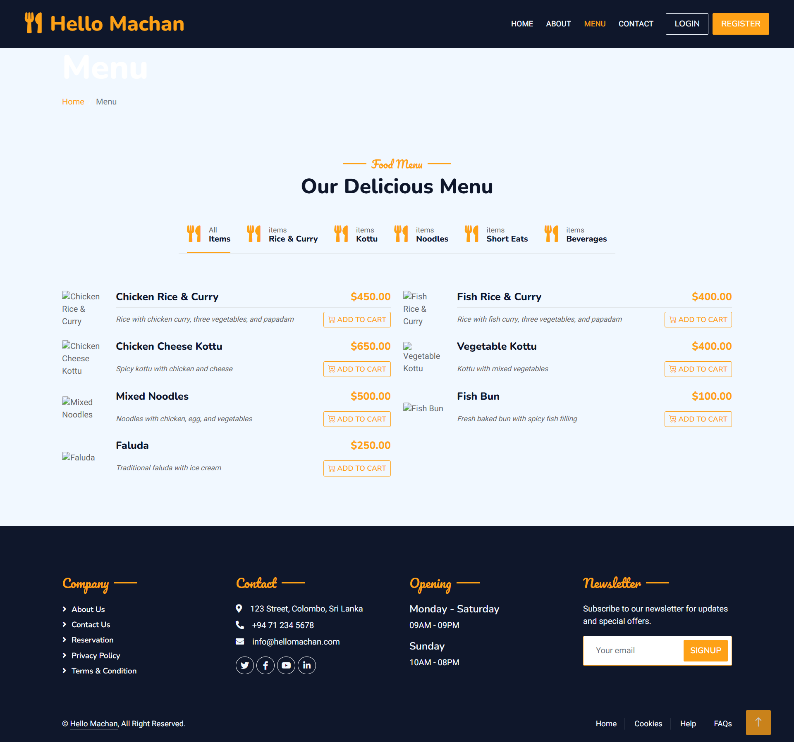
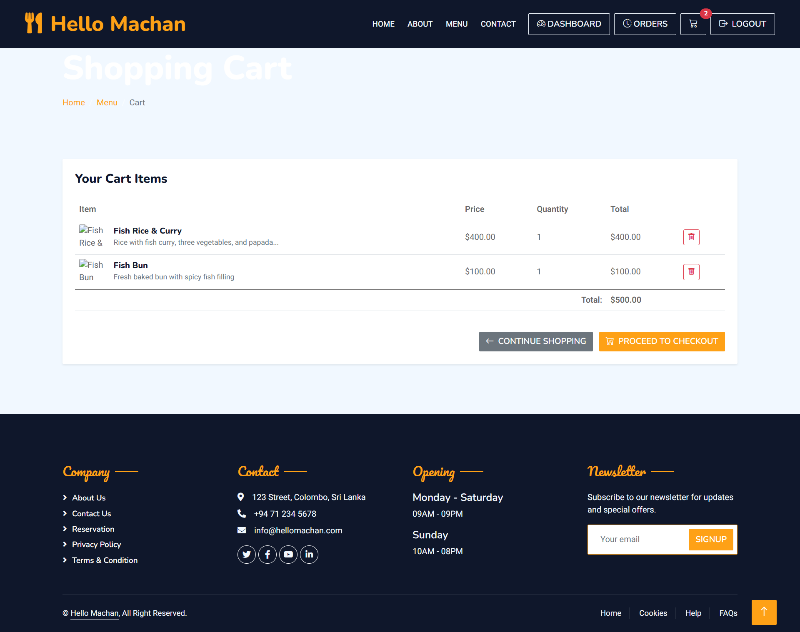
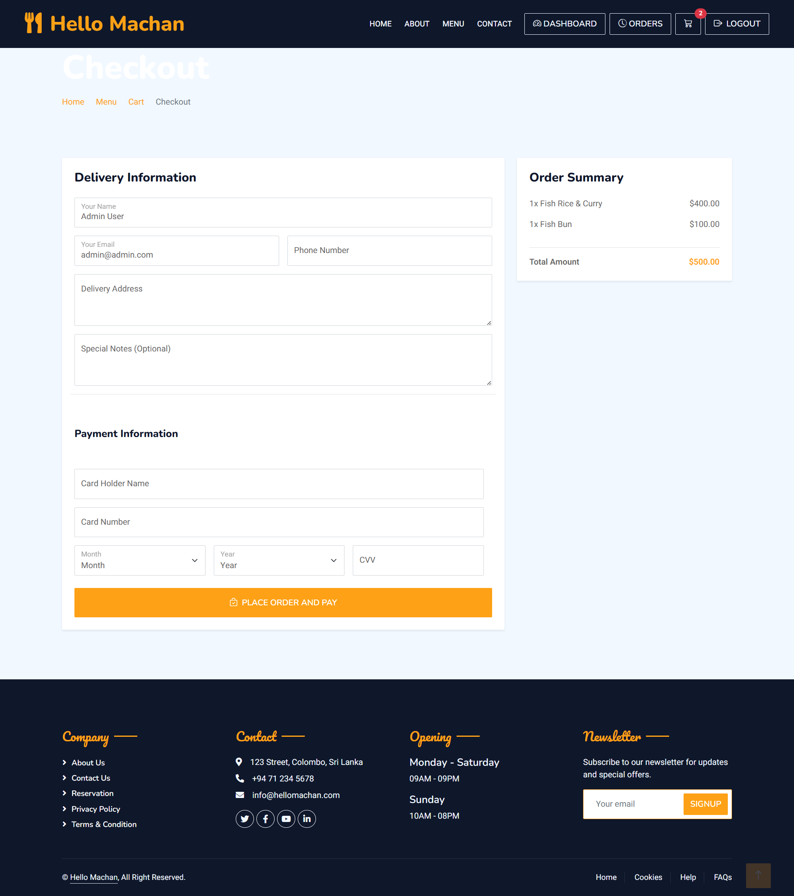
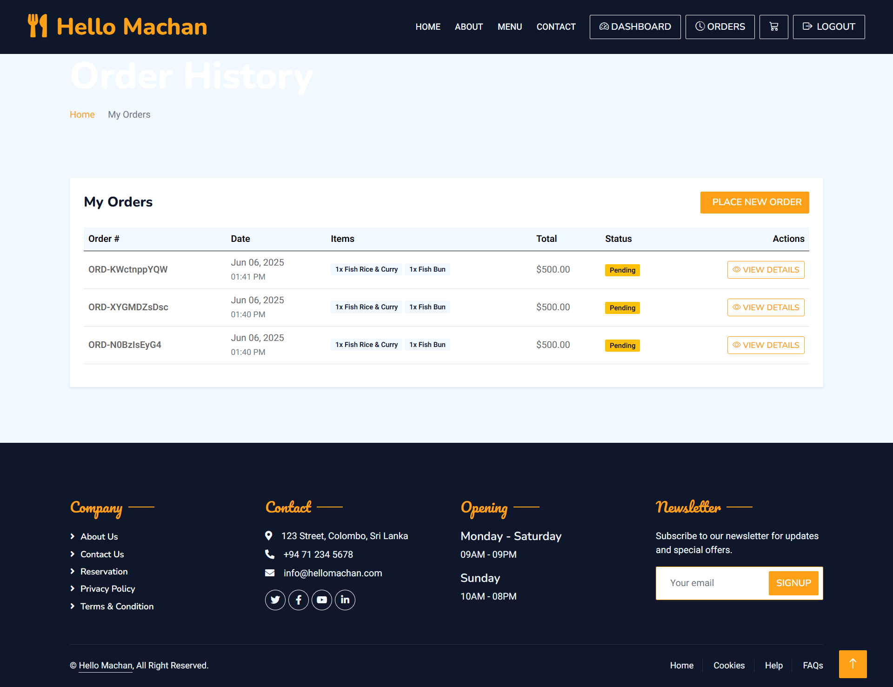
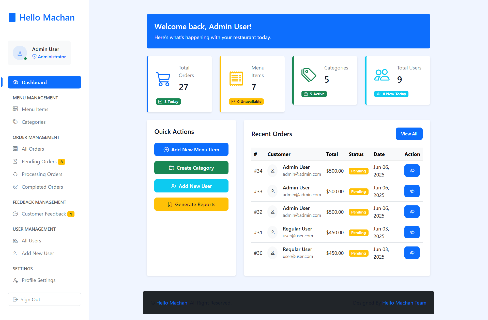

<p align="center"><a href="https://laravel.com" target="_blank"></a></p>

<p align="center">
<a href="https://github.com/laravel/framework/actions"></a>
<a href="https://packagist.org/packages/laravel/framework"></a>
<a href="https://packagist.org/packages/laravel/framework"></a>
<a href="https://packagist.org/packages/laravel/framework"></a>
</p>

# HelloMachan - Food Ordering Web Application

HelloMachan is a Laravel-based food ordering platform that allows users to browse menu items, add them to a cart, checkout with delivery and payment information, and track their orders. The application features user authentication, address management, order feedback, and an admin dashboard for managing menu items, categories, orders, users, and feedback.

## Features

-   User registration, login, and profile management
-   Browse menu items by category
-   Add items to cart and manage cart contents
-   Checkout with saved or new address
-   Payment information collection and storage
-   Order history and order details view
-   Leave feedback on completed orders
-   Admin dashboard for managing menu, orders, users, and feedback

## Screenshots

### Home Page



### Menu Page



### Cart Page



### Checkout Page



### Order Details



### Admin Dashboard



> Place your screenshots in `resources/screenshots/` with the above filenames for them to appear in the README.

## Getting Started

### Prerequisites

-   PHP >= 8.1
-   Composer
-   Node.js & npm
-   MySQL or compatible database

### Installation

1. Clone the repository:
    ```sh
    git clone https://github.com/yourusername/hellomachan.git
    cd hellomachan
    ```
2. Install PHP dependencies:
    ```sh
    composer install
    ```
3. Install JS dependencies:
    ```sh
    npm install
    ```
4. Copy `.env.example` to `.env` and configure your database and mail settings:
    ```sh
    cp .env.example .env
    ```
5. Generate application key:
    ```sh
    php artisan key:generate
    ```
6. Run migrations and seeders:
    ```sh
    php artisan migrate --seed
    ```
7. Build frontend assets:
    ```sh
    npm run build
    ```
8. Start the development server:
    ```sh
    php artisan serve
    ```

Visit [http://localhost:8000](http://localhost:8000) in your browser.

## Folder Structure

-   `app/Http/Controllers/` - Application controllers
-   `app/Models/` - Eloquent models
-   `resources/views/` - Blade templates
-   `routes/web.php` - Web routes
-   `database/migrations/` - Database schema
-   `public/` - Public assets

## License

This project is open source and available under the [MIT License](LICENSE).
